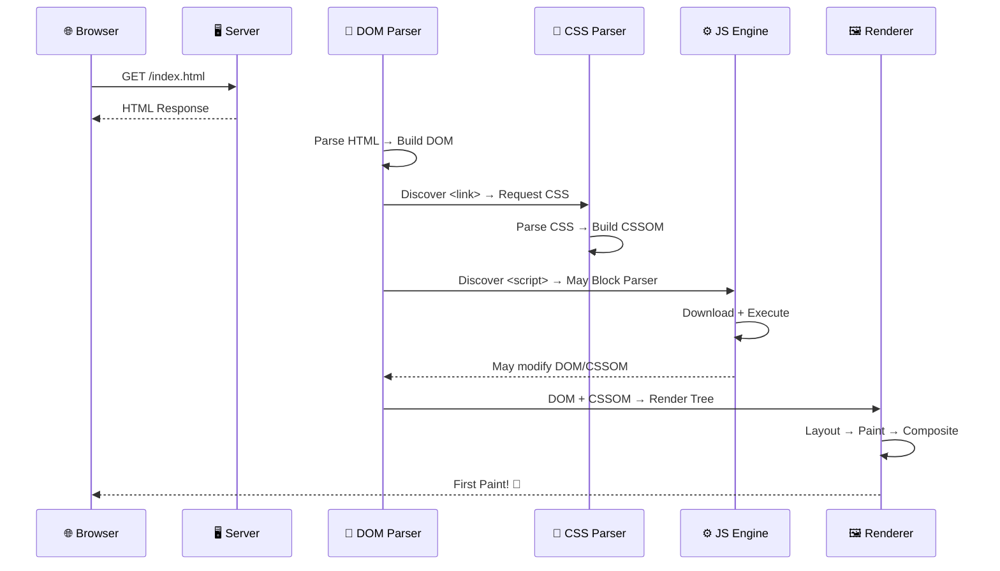

# ⚡ Critical Rendering Path (CRP) — A Complete Guide to Browser Rendering & Performance Optimization

> *"Performance is not a feature — it's the foundation. A millisecond delay in rendering is a lifetime in user perception."*

When you type a URL into your browser and hit Enter, an incredibly complex pipeline kicks in — HTML is downloaded, parsed, combined with CSS, painted into pixels, and composited onto your screen. This pipeline is the **Critical Rendering Path (CRP)**, and mastering it is the key to building fast, delightful web experiences.

If you've ever wondered why your beautifully designed page shows a blank white screen for 3+ seconds before anything appears — the CRP is where the problem lives. 😅

This guide covers **what CRP is**, **why it matters**, **when to optimize**, **how each technique works**, the **pros and cons** of each approach, and the **best practices** every frontend engineer should follow.

---

<a id="top"></a>

## 📚 Table of Contents

- [What is the Critical Rendering Path](#what-is-the-critical-rendering-path)
- [Why CRP Optimization Matters](#why-crp-optimization-matters)
- [When to Optimize the CRP](#when-to-optimize-the-crp)
- [The Rendering Flow High Level](#the-rendering-flow-high-level)
- [The Critical Part of the Path](#the-critical-part-of-the-path)
- [How the Browser Blocks Rendering](#how-the-browser-blocks-rendering)
- [Key Performance Metrics Tied to CRP](#key-performance-metrics-tied-to-crp)
- [CRP Optimization Techniques Deep Dive](#crp-optimization-techniques-deep-dive)
  - [1 Minimize Critical Resources](#1-minimize-critical-resources)
  - [2 Optimize CSS Delivery](#2-optimize-css-delivery)
  - [3 Defer or Async JavaScript](#3-defer-or-async-javascript)
  - [4 Resource Hints Preload Prefetch Preconnect](#4-resource-hints-preload-prefetch-preconnect)
  - [5 Reduce Round Trips Network Optimization](#5-reduce-round-trips-network-optimization)
  - [6 Optimize Images Largest Payload](#6-optimize-images-largest-payload)
  - [7 Minimize Reflow and Repaint](#7-minimize-reflow-and-repaint)
  - [8 Pre rendering and Skeleton Screens](#8-pre-rendering-and-skeleton-screens)
- [Pros vs Cons of Each Optimization Technique](#pros-vs-cons-of-each-optimization-technique)
- [Example CRP Timeline Visualization](#example-crp-timeline-visualization)
- [Example Before vs After Optimization](#example-before-vs-after-optimization)
  - [Before](#before)
  - [After](#after)
- [CRP Optimization in React Next Angular and Vue](#crp-optimization-in-react-next-angular-and-vue)
- [How to Measure and Audit CRP Performance](#how-to-measure-and-audit-crp-performance)
- [Best Steps to Follow A Prioritized Optimization Workflow](#best-steps-to-follow-a-prioritized-optimization-workflow)
- [CRP Optimization Checklist](#crp-optimization-checklist)
- [Key Interview Takeaways](#key-interview-takeaways)
- [Further Reading and Resources](#further-reading-and-resources)

[⬆ Back to Top](#top)

---

## 🔹 What is the Critical Rendering Path

The **Critical Rendering Path** refers to the sequence of steps the browser takes to convert your HTML, CSS, and JavaScript into **pixels rendered on the user's screen**.

It's called "critical" because **any delay in this path directly delays the first paint** — i.e., how fast users see something.

So, **optimizing the CRP = optimizing perceived performance** (Time to First Paint, Time to Interactive, etc.).

### In One Sentence

> The CRP is **everything the browser must do before it can show you the first pixel** — and optimizing it means removing or deferring anything that isn't essential for that first paint.

[⬆ Back to Top](#top)

---

## 🔹 Why CRP Optimization Matters

### The Business Case

| Metric                          | Impact                                                                |
| ------------------------------- | --------------------------------------------------------------------- |
| **53% of mobile users**         | Abandon a site that takes longer than **3 seconds** to load          |
| **Amazon**                      | Every **100ms** of latency costs them **1% of revenue**              |
| **Google**                      | Added 500ms to search results → **20% drop** in traffic              |
| **Pinterest**                   | Reduced perceived wait times by 40% → **15% increase** in sign-ups   |
| **Core Web Vitals (SEO)**       | Google uses LCP, FID/INP, CLS as ranking signals since 2021          |

### Real-World Scenarios Where CRP Matters

| Scenario                             | Why CRP is Critical                                                          |
| ------------------------------------ | ---------------------------------------------------------------------------- |
| E-commerce product page              | Users see a blank screen for 4s → bounce → lost sale                         |
| News article on mobile 3G            | Heavy CSS/JS blocks render → user gives up before reading headline          |
| Dashboard with heavy charts          | Unoptimized JS bundles block interactivity for 6+ seconds                    |
| Marketing landing page               | Slow LCP → lower Google ranking → fewer organic visitors                     |
| Progressive Web App (PWA)            | Service worker + cached CRP = instant re-loads                               |

### Who Benefits from CRP Optimization?

- **Users**: Faster perceived load, less frustration, lower data usage
- **Product teams**: Higher engagement, lower bounce rates, better conversions
- **SEO teams**: Better Core Web Vitals = better search rankings
- **DevOps**: Reduced server load, lower bandwidth costs

[⬆ Back to Top](#top)

---

## 🔹 When to Optimize the CRP

### You Should Optimize CRP When...

| Trigger                                      | Indicator                                                      |
| -------------------------------------------- | -------------------------------------------------------------- |
| LCP > 2.5 seconds                            | Lighthouse or PageSpeed Insights flags it                      |
| FCP > 1.8 seconds                            | Users see a blank page for too long                            |
| Large render-blocking resources in waterfall  | DevTools Network tab shows chained blocking resources          |
| High bounce rate on landing pages             | Analytics shows users leaving before interaction               |
| Poor mobile performance                       | Throttled network shows 5s+ load times                        |
| Bundle size over 200KB (compressed)           | webpack-bundle-analyzer or source-map-explorer flags bloat     |
| Adding third-party scripts (analytics, ads)   | Each script adds to the critical path                         |

### You Can Defer CRP Optimization When...

- Building an internal admin tool (few users, predictable network)
- Prototyping / MVP stage (ship first, optimize later)
- All users are on fast networks with modern devices

> 💡 **Rule of Thumb**: If your app is public-facing or used on mobile, CRP optimization is **not optional** — it's essential.

[⬆ Back to Top](#top)

---

## 🧩 The Rendering Flow High Level

Let's break down the 6 steps the browser follows to render a page:

### Step-by-Step Pipeline

```
HTML Download → DOM Construction → CSSOM Construction → Render Tree → Layout → Paint → Composite
```

1. **HTML Parsing → DOM Construction**

   * The browser downloads and parses HTML to build the **DOM Tree** (Document Object Model).
   * Example:

     ```html
     <body>
       <h1>Hello</h1>
       <p>World</p>
     </body>
     ```

     ➜ DOM Tree nodes created for `<body>`, `<h1>`, `<p>`.

2. **CSS Parsing → CSSOM Construction**

   * Browser downloads and parses all CSS files (inline + external) to build **CSSOM (CSS Object Model)**.
   * Example:

     ```css
     h1 { color: red; }
     p { font-size: 16px; }
     ```

     ➜ CSSOM defines the final computed style for each node.

3. **Render Tree Construction**

   * Combines **DOM + CSSOM** into a **Render Tree**, which includes only *visible elements* (e.g., `display:none` excluded).
   * Each node now knows what to paint (color, size, position, etc.).

4. **Layout (Reflow)**

   * Calculates **exact position and size** of each render tree node.
   * Output: geometry of every visible element.

5. **Paint (Rasterization)**

   * Fills in pixels for each node (color, image, shadow, etc.) in layers.

6. **Composite**

   * Layers are **composited** together to display on screen.

### Visual Summary

| Step             | Input            | Output             | Blocking?                          |
| ---------------- | ---------------- | ------------------- | ---------------------------------- |
| HTML Parsing     | HTML bytes       | DOM Tree            | Blocked by `<script>` tags         |
| CSS Parsing      | CSS bytes        | CSSOM Tree          | Always render-blocking             |
| Render Tree      | DOM + CSSOM      | Visible node tree   | Waits for both DOM and CSSOM       |
| Layout           | Render Tree      | Box geometries      | Triggered by style/DOM changes     |
| Paint            | Layout output    | Pixel layers        | Triggered by visual changes        |
| Composite        | Painted layers   | Final screen output | GPU-accelerated (fast)             |

[⬆ Back to Top](#top)

---

## ⚙️ The Critical Part of the Path

Only **resources** that are **required for the first visible paint** are part of the **critical path**.

* **Critical Resources** → HTML, CSS, JS that block rendering of visible content.
* **Critical Bytes** → Total size of those resources.
* **Critical Path Length** → Number of round trips needed to get them.

Your goal is to:

> 🏃‍♂️ *Reduce the number, size, and dependency depth of critical resources.*

### What Is vs What Isn't Critical

| Resource                    | Critical?  | Why                                                     |
| --------------------------- | ---------- | ------------------------------------------------------- |
| Main HTML document          | ✅ Yes      | Entry point — always needed                             |
| Above-the-fold CSS          | ✅ Yes      | Browser can't paint without it                          |
| Render-blocking `<script>`  | ✅ Yes      | Blocks DOM parsing                                      |
| Below-the-fold CSS          | ❌ No       | Not needed for first paint                              |
| `<script defer>`            | ❌ No       | Downloaded in parallel, runs after parsing              |
| `<script async>`            | ❌ No       | Non-blocking (but may execute before DOM is ready)      |
| Images                      | ❌ No       | Don't block first paint (loaded progressively)           |
| Fonts (by default)          | ⚠️ Partial | Can cause FOIT (Flash of Invisible Text) if not handled |

[⬆ Back to Top](#top)

---

## 🚦 How the Browser Blocks Rendering

Rendering is **blocked** by two types of resources:

### CSS = Render-Blocking

* The browser **cannot paint** until all CSS in the `<head>` is downloaded and parsed into the CSSOM.
* Even if the DOM is fully built, rendering waits for CSS.

### JS = Parser-Blocking

* A `<script>` tag (without `defer` or `async`) **pauses HTML parsing** entirely.
* The browser stops building the DOM, downloads the JS, executes it, then resumes.
* If the JS modifies `document.write()`, `style`, or DOM — the pause is necessary.

### Example: The Blocking Problem

```html
<head>
  <link rel="stylesheet" href="style.css">   <!-- Render-blocking -->
  <script src="app.js"></script>              <!-- Parser-blocking -->
</head>
```

**What happens:**

1. Browser starts parsing HTML → hits `<link>` → starts downloading `style.css`
2. **Rendering is BLOCKED** until `style.css` is fully downloaded + parsed
3. Hits `<script>` → **stops HTML parsing** → downloads + executes `app.js`
4. Only THEN does HTML parsing resume and the page can eventually render

> ⚠️ This means a single slow CSS file or JS file can delay *everything* the user sees.

### The Dependency Chain Visualized

```
HTML Parsing ────┐
                 ├──→ Wait for CSS (render-blocking)
                 ├──→ Stop for JS (parser-blocking)
                 │       └── JS may also wait for CSS (CSSOM)
                 ▼
           Render Tree → Layout → Paint
```

[⬆ Back to Top](#top)

---

## 🔹 Key Performance Metrics Tied to CRP

Understanding which metrics CRP affects helps you prioritize optimizations:

| Metric                             | Full Name                     | What It Measures                           | CRP Impact | Good Threshold |
| ---------------------------------- | ----------------------------- | ------------------------------------------ | ---------- | -------------- |
| **FP**                             | First Paint                   | First pixel rendered (any content)         | Direct     | < 1s           |
| **FCP**                            | First Contentful Paint        | First meaningful text/image rendered       | Direct     | < 1.8s         |
| **LCP**                            | Largest Contentful Paint      | Largest visible element rendered           | Direct     | < 2.5s         |
| **TTI**                            | Time to Interactive           | Page fully usable (responds to input)      | Direct     | < 3.8s         |
| **TBT**                            | Total Blocking Time           | Time main thread is blocked (FCP → TTI)    | Indirect   | < 200ms        |
| **INP**                            | Interaction to Next Paint     | Responsiveness of all interactions         | Indirect   | < 200ms        |
| **CLS**                            | Cumulative Layout Shift       | Visual stability during load               | Indirect   | < 0.1          |

### How CRP Optimization Maps to Metrics

```
Inline critical CSS          → Improves FCP, LCP
Defer non-essential JS       → Improves TTI, TBT
Preload key resources        → Improves LCP
Compress + CDN               → Improves all metrics
Lazy-load images             → Improves LCP, CLS
Font display strategy        → Improves FCP, CLS
```

[⬆ Back to Top](#top)

---

## 🧭 CRP Optimization Techniques Deep Dive

Here's the exhaustive deep-dive — each technique includes **what it does, how to implement it, when to use it, and trade-offs**.

---

### 1 Minimize Critical Resources

**What**: Reduce the number of render-blocking resources the browser must download before first paint.

**Why**: Every render-blocking resource adds a round trip. Fewer critical resources = fewer round trips = faster first paint.

**How**:

* **Remove unused CSS** (via PurgeCSS, CSS Tree-shaking)
* **Lazy-load JS modules** not needed at start
* **Defer non-critical JS** (`<script defer>` or `async`)
* **Split CSS per route** instead of one giant bundle
* **Remove dead code** (tree-shaking via Webpack/Rollup/Vite)

```javascript
// ❌ Importing entire library (loads everything)
import _ from 'lodash';

// ✅ Import only what you need (tree-shakeable)
import debounce from 'lodash/debounce';
```

```javascript
// ❌ Loading everything upfront
import HeavyChartLibrary from './charts';

// ✅ Dynamic import — loads only when needed
const HeavyChartLibrary = React.lazy(() => import('./charts'));
```

**When to use**: Always — this should be the default mindset.

---

### 2 Optimize CSS Delivery

**What**: CSS is render-blocking by nature — every `<link rel="stylesheet">` in the `<head>` blocks painting. The goal is to inline what's needed immediately and defer the rest.

**Why**: The browser cannot render a single pixel until ALL CSS in the head is downloaded and parsed into the CSSOM. A 200KB CSS file on a slow 3G connection = 3+ seconds of blank screen.

**How**:

#### A) Inline Critical CSS

Extract only the CSS needed for above-the-fold content and inline it directly:

```html
<head>
  <!-- ✅ Inline critical CSS — available immediately, no network request -->
  <style>
    body { font-family: system-ui, sans-serif; margin: 0; }
    header { background: #1a1a2e; color: #fff; padding: 1rem; }
    .hero { padding: 2rem; font-size: 1.5rem; }
  </style>
</head>
```

#### B) Load Non-Critical CSS Asynchronously

```html
<!-- ✅ Load remaining CSS without blocking render -->
<link rel="stylesheet" href="noncritical.css" media="print" onload="this.media='all'">
<noscript><link rel="stylesheet" href="noncritical.css"></noscript>
```

#### C) Use Media Queries to Conditionally Load Styles

```html
<!-- ✅ Only blocks rendering when media matches -->
<link rel="stylesheet" href="print.css" media="print">
<link rel="stylesheet" href="desktop.css" media="(min-width: 768px)">
```

#### D) Automate Critical CSS Extraction

```javascript
// Using the 'critical' npm package in your build pipeline
const critical = require('critical');

critical.generate({
  inline: true,
  base: 'dist/',
  src: 'index.html',
  target: 'index-critical.html',
  width: 1300,
  height: 900
});
```

**When to use**: Every public-facing page — especially landing pages and e-commerce.

---

### 3 Defer or Async JavaScript

**What**: By default, `<script>` tags block HTML parsing. `defer` and `async` attributes change this behavior.

**Why**: A single parser-blocking script can freeze DOM construction for seconds while it downloads and executes.

**How**:

```html
<!-- ❌ DEFAULT: Parser-blocking — stops HTML parsing -->
<script src="app.js"></script>

<!-- ✅ DEFER: Download in parallel, execute AFTER HTML parsing completes -->
<script src="app.js" defer></script>

<!-- ✅ ASYNC: Download in parallel, execute IMMEDIATELY when ready -->
<script src="analytics.js" async></script>

<!-- ✅ MODULE: Deferred by default, supports import/export -->
<script type="module" src="app.mjs"></script>
```

### `defer` vs `async` vs `module` — Complete Comparison

| Feature               | Default `<script>`   | `defer`              | `async`              | `type="module"`      |
| --------------------- | -------------------- | -------------------- | -------------------- | -------------------- |
| Blocks HTML parsing?  | ✅ Yes                | ❌ No                 | ❌ No                 | ❌ No                 |
| Download              | Sequential           | Parallel             | Parallel             | Parallel             |
| Execution timing      | Immediately          | After DOM parsed     | When download done   | After DOM parsed     |
| Execution order        | In order             | ✅ In order           | ❌ Race condition     | ✅ In order           |
| Use case              | Legacy only          | App logic            | Analytics, ads       | Modern ES modules    |
| DOM accessible?       | Partial (up to tag)  | ✅ Full DOM ready     | ❌ Not guaranteed     | ✅ Full DOM ready     |

### Visual Timeline

```
Default <script>:
  HTML ──── [PAUSE] ─── download + execute ─── [RESUME] ──── HTML

<script defer>:
  HTML ────────────────────────────── DOM ready ─── execute
        ↳ download (parallel) ─────┘

<script async>:
  HTML ──────── [PAUSE] ── execute ── [RESUME] ──── HTML
        ↳ download ──┘

<script type="module">:
  HTML ────────────────────────────── DOM ready ─── execute
        ↳ download (parallel) ─────┘  (same as defer, + module scope)
```

### When to Use Each

| Script Type                   | Use                           |
| ----------------------------- | ----------------------------- |
| Core app logic                | `defer`                       |
| Analytics, tracking, ads      | `async`                       |
| ES module-based app           | `type="module"`               |
| Inline critical bootstrap     | Inline `<script>` (small)     |
| Legacy jQuery widget          | `defer` or move to `</body>`  |

**Code splitting** further reduces JS on the critical path:

```javascript
// Webpack / Vite — dynamic imports create separate chunks
const ProductPage = React.lazy(() => import('./pages/ProductPage'));
const AdminPanel = React.lazy(() => import('./pages/AdminPanel'));
```

---

### 4 Resource Hints Preload Prefetch Preconnect

**What**: Resource hints tell the browser ahead of time what resources it will need, allowing earlier fetching.

**Why**: Without hints, the browser discovers resources only as it parses HTML. By that time, it may be too late. Hints give the browser a head start.

**How**:

```html
<!-- PRELOAD: Fetch this resource NOW — it's critical for current page -->
<link rel="preload" href="/fonts/inter.woff2" as="font" type="font/woff2" crossorigin>
<link rel="preload" href="/hero-image.webp" as="image">
<link rel="preload" href="/critical.css" as="style">

<!-- PREFETCH: Fetch this resource at LOW priority — might need it on NEXT page -->
<link rel="prefetch" href="/next-page-bundle.js">
<link rel="prefetch" href="/dashboard-data.json">

<!-- PRECONNECT: Establish connection early (DNS + TCP + TLS) -->
<link rel="preconnect" href="https://fonts.googleapis.com">
<link rel="preconnect" href="https://api.myapp.com" crossorigin>

<!-- DNS-PREFETCH: Just resolve DNS (lighter than preconnect) -->
<link rel="dns-prefetch" href="https://analytics.example.com">
```

### Resource Hints Comparison

| Hint             | Priority   | When to Use                                 | Cost                    |
| ---------------- | ---------- | ------------------------------------------- | ----------------------- |
| `preload`        | 🔴 High    | Resources needed on current page NOW        | Bandwidth (use wisely)  |
| `prefetch`       | 🟢 Low     | Resources likely needed on next navigation  | Low (idle bandwidth)    |
| `preconnect`     | 🟡 Medium  | Third-party origins you'll fetch from      | Connection overhead     |
| `dns-prefetch`   | 🟢 Low     | DNS resolution for external domains         | Minimal                 |
| `modulepreload`  | 🔴 High    | ES module scripts needed immediately         | Same as preload         |

> ⚠️ **Warning**: Overusing `preload` wastes bandwidth. Chrome warns in console: *"The resource was preloaded but not used within a few seconds."* Only preload what you actually use on the current page.

---

### 5 Reduce Round Trips Network Optimization

**What**: Minimize the number of sequential network requests and total bytes transferred before first render.

**Why**: Each HTTP request requires a network round trip (DNS → TCP → TLS → Request → Response). On 3G, each round trip can take 300-600ms.

**How**:

```html
<!-- ✅ Preconnect to key origins -->
<link rel="preconnect" href="https://fonts.googleapis.com">
<link rel="preconnect" href="https://cdn.mysite.com" crossorigin>
```

| Technique                    | How It Helps                                         | How to Implement                           |
| ---------------------------- | ---------------------------------------------------- | ------------------------------------------ |
| **HTTP/2 or HTTP/3**         | Multiplexes requests over single connection          | Server config (nginx, Cloudflare)          |
| **Brotli compression**       | ~20% smaller than gzip                               | Server/CDN config: `Content-Encoding: br`  |
| **CDN**                      | Serves from edge locations close to user             | Cloudflare, CloudFront, Fastly, Vercel     |
| **Bundle splitting**         | Smaller initial chunks                               | Webpack/Vite `splitChunks`                 |
| **Inline small resources**   | Eliminates a round trip entirely                     | Inline SVGs, small CSS, critical JS        |
| **Server Push (HTTP/2)**     | Server sends resources before browser requests them  | Server config (use cautiously)             |
| **103 Early Hints**          | Server sends `Link` headers before full response     | Supported by Cloudflare, modern servers    |

```nginx
# Nginx: Enable Brotli compression
brotli on;
brotli_comp_level 6;
brotli_types text/html text/css application/javascript application/json;
```

```javascript
// Webpack: Split vendor and app bundles
module.exports = {
  optimization: {
    splitChunks: {
      chunks: 'all',
      cacheGroups: {
        vendor: {
          test: /[\\/]node_modules[\\/]/,
          name: 'vendors',
          chunks: 'all',
        },
      },
    },
  },
};
```

---

### 6 Optimize Images Largest Payload

**What**: Images are often the largest resources on a page. While they don't block the CRP, they directly impact **LCP** (Largest Contentful Paint).

**Why**: A 2MB uncompressed hero image on mobile 3G takes 15+ seconds to load. The LCP element is often an image.

**How**:

```html
<!-- ✅ Responsive images — serve appropriate size -->


<!-- ✅ Lazy-load below-the-fold images -->


<!-- ✅ Modern format with fallback -->
<picture>
  <source srcset="hero.avif" type="image/avif" />
  <source srcset="hero.webp" type="image/webp" />
  
</picture>
```

| Technique                  | Impact                   | Implementation                              |
| -------------------------- | ------------------------ | ------------------------------------------- |
| **WebP / AVIF formats**    | 25-50% smaller than JPEG | Build tool (sharp, squoosh) or CDN auto     |
| **Responsive srcset**      | Right size for device    | `srcset` + `sizes` attributes               |
| **Lazy loading**           | Defers off-screen images | `loading="lazy"` (native)                   |
| **Explicit dimensions**    | Prevents CLS             | Always set `width` + `height`               |
| **fetchpriority="high"**   | Prioritizes LCP image    | Add to hero/LCP image                       |
| **Preload LCP image**      | Earlier discovery         | `<link rel="preload" as="image">`           |
| **Image CDN**              | Auto-optimize + resize   | Cloudinary, imgix, Vercel Image Optimization|

> 💡 **Pro tip**: For the LCP image, use `fetchpriority="high"` AND `<link rel="preload">` — do NOT set `loading="lazy"` on it.

---

### 7 Minimize Reflow and Repaint

**What**: After the initial render, any DOM or style change triggers either a **reflow** (layout recalculation) or **repaint** (pixel update). Excessive reflows destroy runtime performance.

**Why**: Reflow is the browser's most expensive operation — it recalculates geometry for the entire render tree (or subtree). Triggering it inside a loop can freeze the UI.

**How**:

#### What Triggers Reflow vs Repaint

| Trigger                                      | Reflow? | Repaint? | Example                                   |
| -------------------------------------------- | ------- | -------- | ----------------------------------------- |
| Changing `width`, `height`, `margin`         | ✅       | ✅        | `el.style.width = '200px'`                |
| Changing `color`, `background`               | ❌       | ✅        | `el.style.color = 'red'`                  |
| Reading layout properties                    | ✅       | ❌        | `el.offsetHeight`, `el.getBoundingClientRect()` |
| Adding/removing DOM nodes                    | ✅       | ✅        | `parent.appendChild(child)`               |
| Changing `transform`, `opacity`              | ❌       | ❌        | GPU-composited — bypasses both!           |

#### Avoid Layout Thrashing

```javascript
// ❌ Layout thrashing — read/write cycle in a loop forces reflow on EVERY iteration
for (let i = 0; i < items.length; i++) {
  items[i].style.width = container.offsetWidth + 'px'; // read → reflow → write → repeat
}

// ✅ Batch reads, then batch writes
const width = container.offsetWidth; // One read
for (let i = 0; i < items.length; i++) {
  items[i].style.width = width + 'px'; // Multiple writes (batched by browser)
}
```

#### Use CSS Transforms for Animations

```css
/* ❌ Triggers layout on every frame — janky animation */
.animate-bad {
  transition: left 0.3s, top 0.3s;
}

/* ✅ GPU-accelerated — smooth 60fps, skips layout and paint */
.animate-good {
  transition: transform 0.3s;
  will-change: transform;
}
```

#### Use `will-change` Wisely

```css
/* ✅ Hint to browser: promote to its own compositor layer */
.card-hover {
  will-change: transform;
}

/* ❌ Don't overuse — each promoted layer uses GPU memory */
* { will-change: transform; } /* BAD — massive memory overhead */
```

#### Use `content-visibility` for Off-Screen Content

`content-visibility: auto` is one of the most impactful single-property CSS optimizations available. It tells the browser: **"Don't bother rendering this element's content until it's close to the viewport."** The browser skips style calculation, layout, and paint for off-screen elements entirely — potentially saving **hundreds of milliseconds** on initial render for content-heavy pages.

```css
/* ✅ Browser skips rendering for off-screen sections entirely */
.below-the-fold-section {
  content-visibility: auto;
  contain-intrinsic-size: 0 500px; /* Estimated height for scrollbar accuracy */
}
```

**How it works:**

```
Without content-visibility:
  Browser renders ALL sections on page load:
  ┌──────────────┐
  │  Section 1   │ ← Rendered ✅ (visible in viewport)
  │  Section 2   │ ← Rendered ✅ (visible in viewport)
  │  Section 3   │ ← Rendered ❌ (off-screen but STILL rendered!)
  │  Section 4   │ ← Rendered ❌ (off-screen but STILL rendered!)
  │  ...         │
  │  Section 20  │ ← Rendered ❌ (off-screen but STILL rendered!)
  └──────────────┘
  Total rendering work: ALL 20 sections

With content-visibility: auto:
  Browser SKIPS off-screen sections:
  ┌──────────────┐
  │  Section 1   │ ← Rendered ✅ (visible)
  │  Section 2   │ ← Rendered ✅ (visible)
  │  Section 3   │ ← SKIPPED 🚀 (rendered when user scrolls near)
  │  Section 4   │ ← SKIPPED 🚀
  │  ...         │
  │  Section 20  │ ← SKIPPED 🚀
  └──────────────┘
  Total rendering work: ONLY 2 sections (rest deferred)
```

**Why `contain-intrinsic-size` is needed:**

When the browser skips rendering an element, it doesn't know the element's height. Without a size hint, the element collapses to 0px → the scrollbar jumps as sections render on scroll. `contain-intrinsic-size` provides an **estimated height** so the scrollbar behaves correctly.

```css
/* Modern syntax — auto keyword remembers measured size after first render */
.section {
  content-visibility: auto;
  contain-intrinsic-size: auto 500px; /* Uses 500px initially, then remembers actual size */
}
```

**`content-visibility` values:**

| Value    | Behavior                                                  | Use Case                              |
| -------- | --------------------------------------------------------- | ------------------------------------- |
| `visible`| Default — render normally                                 | No change                             |
| `auto`   | Skip rendering when off-screen, render when near viewport | Long pages, below-the-fold content    |
| `hidden` | Never render (like `display: none` but preserves layout)  | Tabs, collapsed accordion panels      |

**Practical example — long article page:**

```css
/* Apply to each major section of the page */
article section {
  content-visibility: auto;
  contain-intrinsic-size: auto 300px;
}

/* Apply to footer and non-critical regions */
.comments-section,
.related-articles,
footer {
  content-visibility: auto;
  contain-intrinsic-size: auto 400px;
}
```

**Real-world impact:** Google's own measurements showed `content-visibility: auto` can reduce rendering time by **up to 7x** on content-heavy pages. A blog page with 20 sections that takes 200ms to render might drop to under 30ms for initial paint.

**Browser support:** Chrome 85+, Edge 85+, Firefox 125+, Safari 18+. For older browsers, the property is simply ignored — content renders normally.

> ⚠️ **Gotcha:** Don't apply `content-visibility: auto` to above-the-fold content — the browser may briefly show a blank space before rendering it. Only use it for content **below** the initial viewport.

---

### 8 Pre rendering and Skeleton Screens

**What**: Improve *perceived performance* by showing content or placeholders faster, even before JavaScript fully loads.

**Why**: Even with CRP optimization, complex SPAs take time to hydrate. Pre-rendering and skeleton screens fill the gap.

**How**:

| Strategy                  | What It Does                                   | When to Use                           | Framework Support                    |
| ------------------------- | ---------------------------------------------- | ------------------------------------- | ------------------------------------ |
| **SSR**                   | Server renders HTML on each request            | Dynamic pages, SEO-critical content   | Next.js, Nuxt, Angular Universal     |
| **SSG**                   | HTML precomputed at build time                 | Blogs, docs, marketing pages          | Next.js, Gatsby, Astro, Hugo         |
| **ISR**                   | SSG + background revalidation                  | E-commerce product pages              | Next.js                              |
| **Streaming SSR**         | Server sends HTML chunks progressively         | Large pages, improve TTFB             | Next.js App Router, React 18         |
| **Skeleton Screens**      | Show animated placeholders during load         | Any dynamic content area              | Custom CSS / component libraries     |
| **Partial Hydration**     | Only hydrate interactive parts                 | Content-heavy pages with few widgets  | Astro, Qwik                          |

```jsx
// React skeleton example
function ProductCardSkeleton() {
  return (
    <div className="card skeleton" aria-busy="true" aria-label="Loading product">
      <div className="skeleton-image" />
      <div className="skeleton-line" style={{ width: '80%' }} />
      <div className="skeleton-line" style={{ width: '50%' }} />
    </div>
  );
}

function ProductList() {
  const { data, isLoading } = useProducts();

  if (isLoading) {
    return Array.from({ length: 6 }, (_, i) => <ProductCardSkeleton key={i} />);
  }

  return data.map(product => <ProductCard key={product.id} product={product} />);
}
```

```css
/* Skeleton shimmer animation */
.skeleton {
  background: #e0e0e0;
  border-radius: 8px;
  overflow: hidden;
  position: relative;
}

.skeleton::after {
  content: '';
  position: absolute;
  top: 0;
  left: -100%;
  width: 100%;
  height: 100%;
  background: linear-gradient(90deg, transparent, rgba(255,255,255,0.4), transparent);
  animation: shimmer 1.5s infinite;
}

@keyframes shimmer {
  100% { left: 100%; }
}
```

[⬆ Back to Top](#top)

---

## 🔹 Pros vs Cons of Each Optimization Technique

| Technique                    | ✅ Pros                                                        | ❌ Cons / Trade-offs                                         | Complexity |
| ---------------------------- | -------------------------------------------------------------- | ------------------------------------------------------------ | ---------- |
| Inline Critical CSS          | Instant first paint, no extra request                          | Increases HTML size, not cached separately, hard to maintain | Medium     |
| Async CSS Loading            | Non-blocking, cacheable                                        | FOUC (Flash of Unstyled Content) possible                    | Low        |
| `<script defer>`             | Non-blocking, maintains order, full DOM access                 | Must wait for all deferred scripts before execution          | Low        |
| `<script async>`             | Non-blocking, executes immediately                             | No execution order guarantee, DOM may not be ready           | Low        |
| Code Splitting               | Smaller initial bundle, faster TTI                             | More requests, waterfall if not preloaded                    | Medium     |
| Preload                      | Ensures critical resources fetched early                       | Wasted bandwidth if not used, console warnings               | Low        |
| Prefetch                     | Speeds up next-page navigation                                 | Wastes data if user doesn't navigate there                   | Low        |
| SSR                          | Fast FCP, SEO-friendly, works without JS                       | Server cost, TTFB increase, hydration complexity             | High       |
| SSG                          | Instant TTFB, CDN-friendly, zero server cost                   | Stale content, long build times for large sites              | Medium     |
| Streaming SSR                | Progressive rendering, fast TTFB                                | Complex error handling, not all frameworks support it        | High       |
| Image Optimization           | Major payload reduction, better LCP                            | Build pipeline complexity, quality trade-offs                | Medium     |
| Brotli Compression           | ~20% smaller than gzip, broad support                          | Higher compression CPU cost (pre-compress at build)           | Low        |
| CDN                          | Global low-latency delivery, caching                           | Cache invalidation complexity, cost                          | Low        |
| `content-visibility: auto`   | Massive rendering perf gain for long pages                     | Can cause scrollbar jumps, `contain-intrinsic-size` needed   | Low        |
| `will-change`                | GPU acceleration for animations                                | Excessive use wastes GPU memory                               | Low        |
| Skeleton Screens             | Better perceived performance, reduces bounce                   | Still requires actual data to load                           | Low        |

[⬆ Back to Top](#top)

---

## 📊 Example CRP Timeline Visualization


```mermaid
sequenceDiagram
    participant Browser as 🌐 Browser
    participant Server as 🖥️ Server
    participant DOM as 📄 DOM Parser
    participant CSSOM as 🎨 CSS Parser
    participant JS as ⚙️ JS Engine
    participant Render as 🖼️ Renderer

    Browser->>Server: GET /index.html
    Server-->>Browser: HTML Response
    DOM->>DOM: Parse HTML → Build DOM
    DOM->>CSSOM: Discover <link> → Request CSS
    CSSOM->>CSSOM: Parse CSS → Build CSSOM
    DOM->>JS: Discover <script> → May Block Parser
    JS->>JS: Download + Execute
    JS-->>DOM: May modify DOM/CSSOM
    DOM->>Render: DOM + CSSOM → Render Tree
    Render->>Render: Layout → Paint → Composite
    Render-->>Browser: First Paint! 🎉
```

[⬆ Back to Top](#top)

---

## 🧩 Example Before vs After Optimization

### ❌ Before

```html
<head>
  <link rel="stylesheet" href="main.css">
  <script src="jquery.js"></script>
  <script src="analytics.js"></script>
</head>
<body>
  <header>Welcome</header>
  <main>...</main>
</body>
```

### Step-by-Step Breakdown (Before Optimization)

#### HTML Download Starts

* Browser starts downloading HTML from the server.
* As it parses the HTML, it encounters resources (`<link>` and `<script>`).

---

#### Encounter `<link rel="stylesheet" href="main.css">`

* CSS files are **render-blocking**.
* The browser **pauses rendering** until the CSS file is fully downloaded and parsed (to build the CSSOM).

⛔ **Why?**
Because the browser must know *what elements look like* before painting anything on screen.

---

#### Encounter `<script src="jquery.js"></script>`

* JavaScript files (without `defer` or `async`) are **parser-blocking**.
* HTML parsing **stops completely** until `jquery.js` is downloaded and executed.

⛔ **Why?**
Because JS can modify the DOM or CSSOM dynamically (e.g., `document.write()`, `style changes`), so the browser can't safely continue building the DOM until the JS finishes.

---

#### Encounter `<script src="analytics.js"></script>`

* Same issue: blocks HTML parsing again.
* Even though analytics doesn't affect rendering, it still delays everything.

---

#### Browser Builds:

* DOM Tree (after parsing resumes)
* CSSOM Tree (after CSS downloaded)
* Render Tree (combining both)

Only after both **DOM + CSSOM** are ready does the **render tree** form and **painting starts**.

⏳ So user waits unnecessarily long — even for **non-critical scripts** like analytics.

---

### Measured Performance Impact (Before)

| Metric               | What Happens        | Impact           |
| -------------------- | ------------------- | ---------------- |
| DOM Parsing          | Blocked by JS       | Slow             |
| CSSOM Building       | Blocks render       | Delayed FCP      |
| JavaScript Execution | Blocks DOM          | Delayed TTI      |
| Network Requests     | Sequential          | More round trips |
| Perceived Load Time  | Blank screen longer | Poor UX          |

---

### ✅ After

```html
<head>
  <!-- 0️⃣ Preconnect to critical origins -->
  <link rel="preconnect" href="https://fonts.googleapis.com" crossorigin>

  <!-- 1️⃣ Inline only critical CSS -->
  <style>
    header { background: #fff; font-family: sans-serif; }
    .hero { padding: 2rem; font-size: 1.5rem; }
  </style>

  <!-- 2️⃣ Preload & load non-critical CSS async -->
  <link rel="preload" href="main.css" as="style" onload="this.rel='stylesheet'">
  <noscript><link rel="stylesheet" href="main.css"></noscript>

  <!-- 3️⃣ Preload LCP image -->
  <link rel="preload" href="hero.webp" as="image" fetchpriority="high">

  <!-- 4️⃣ Load app logic after parsing -->
  <script src="main.js" defer></script>

  <!-- 5️⃣ Load non-critical JS async -->
  <script src="analytics.js" async></script>
</head>
<body>
  <header>Welcome</header>
  <main>
    
    ...
  </main>
</body>
```

### Step-by-Step Breakdown (After Optimization)

#### Inline Critical CSS

* Inlines just enough styles for the **above-the-fold content** (header, layout basics).
* Browser can **start painting immediately**, even before downloading external CSS.

🎯 *This directly reduces Time to First Paint (FP) and First Contentful Paint (FCP).*

---

#### Load Non-Critical CSS Asynchronously

```html
<link rel="preload" href="main.css" as="style" onload="this.rel='stylesheet'">
```

* **`preload`** hints the browser: "fetch this early" (high priority).
* But rendering **doesn't block** because it's not a render-blocking stylesheet yet.
* After it loads, the `onload` handler changes `rel` to `stylesheet`, applying the CSS.

⚡ Result:

* Browser starts downloading `main.css` *early*, but doesn't block first paint.

---

#### Defer Main JS Logic

```html
<script src="main.js" defer></script>
```

* `defer` downloads the script **in parallel** with HTML parsing.
* It executes **only after the DOM is fully built**.
* Doesn't block DOM construction.

⚡ Result:

* Faster parsing and earlier rendering.
* JS logic still runs at the right time.

---

#### Async for Non-Critical JS

```html
<script src="analytics.js" async></script>
```

* `async` downloads the script **in parallel** and executes it **immediately after downloading**.
* Doesn't block DOM parsing.
* Best for **independent scripts** (e.g., analytics, ads, metrics).

⚡ Result:

* Analytics loads fast, but doesn't delay rendering.

---

#### What Happens Now (Optimized Flow)

1. Browser downloads HTML → starts parsing immediately.
2. Inline CSS available instantly → early paint possible.
3. `main.css` fetched asynchronously (won't block rendering).
4. LCP image preloaded → starts downloading immediately.
5. DOM parsing continues uninterrupted.
6. JS files (`main.js`, `analytics.js`) downloaded in parallel.
7. `main.js` runs *after DOM ready*; `analytics.js` runs *whenever ready*.
8. User sees page **much earlier**.

---

### Measured Performance Impact (After)

| Metric                    | What Happens                | Impact             |
| ------------------------- | --------------------------- | ------------------ |
| DOM Parsing               | Non-blocked                 | ✅ Faster           |
| CSSOM Building            | Critical inline + async CSS | ✅ Parallelized     |
| JS Execution              | Deferred / async            | ✅ Non-blocking     |
| Network Requests          | Parallel                    | ✅ Fewer delays     |
| Perceived Load Time       | Early paint possible        | ✅ Great UX         |
| Core Web Vitals (FCP/LCP) | Improved                    | ✅ Significant gain |

[⬆ Back to Top](#top)

---

## 🔹 CRP Optimization in React Next Angular and Vue

### React (Client-Side Rendered)

React apps ship a **minimal HTML shell** + a **large JS bundle** — the CRP includes downloading and executing that entire bundle before users see anything.

```jsx
// ❌ One giant bundle — everything loads upfront
import Dashboard from './Dashboard';
import AdminPanel from './AdminPanel';
import Analytics from './Analytics';

// ✅ Code split with React.lazy — only load what's needed
const Dashboard = React.lazy(() => import('./Dashboard'));
const AdminPanel = React.lazy(() => import('./AdminPanel'));
const Analytics = React.lazy(() => import('./Analytics'));

function App() {
  return (
    <Suspense fallback={<PageSkeleton />}>
      <Routes>
        <Route path="/" element={<Dashboard />} />
        <Route path="/admin" element={<AdminPanel />} />
        <Route path="/analytics" element={<Analytics />} />
      </Routes>
    </Suspense>
  );
}
```

**Key CRP optimizations for React**:
- Code split every route with `React.lazy()`
- Use `<Suspense>` with meaningful loading states
- Preload route chunks: `<link rel="prefetch" href="/static/js/admin-chunk.js">`
- Use Vite or Webpack `splitChunks` for vendor separation

---

### Next.js (SSR / SSG / ISR)

Next.js solves most CRP problems by default:

```jsx
// pages/product/[id].js — SSG with ISR (best for e-commerce)
export async function getStaticProps({ params }) {
  const product = await fetchProduct(params.id);
  return {
    props: { product },
    revalidate: 60, // Regenerate every 60 seconds
  };
}

export async function getStaticPaths() {
  const topProducts = await fetchTopProducts();
  return {
    paths: topProducts.map(p => ({ params: { id: p.id } })),
    fallback: 'blocking', // SSR for new paths
  };
}
```

```jsx
// app/layout.tsx — Next.js App Router with streaming
import { Suspense } from 'react';

export default function Layout({ children }) {
  return (
    <html lang="en">
      <body>
        <Header /> {/* Rendered instantly (server component) */}
        <Suspense fallback={<PageSkeleton />}>
          {children} {/* Streamed progressively */}
        </Suspense>
      </body>
    </html>
  );
}
```

**Next.js CRP features**:
- Automatic code splitting per page
- CSS Modules / Tailwind purged at build time
- Image Optimization with `next/image` (auto formats, sizing, lazy load)
- Font optimization with `next/font` (zero layout shift)
- Server Components (zero client JS for static content)

---

### Angular

```typescript
// Angular: Lazy-load routes to reduce initial bundle
const routes: Routes = [
  { path: '', component: HomeComponent },
  {
    path: 'admin',
    loadChildren: () => import('./admin/admin.module').then(m => m.AdminModule)
  },
  {
    path: 'analytics',
    loadComponent: () => import('./analytics/analytics.component').then(m => m.AnalyticsComponent)
  }
];
```

```json
// angular.json — Enable build optimization
{
  "optimization": true,
  "buildOptimizer": true,
  "extractCss": true,
  "namedChunks": false,
  "aot": true,
  "outputHashing": "all"
}
```

**Angular CRP optimizations**:
- Lazy-load feature modules with `loadChildren`
- Angular Universal for SSR
- `@angular/common` `NgOptimizedImage` directive
- AOT compilation (smaller bundles, faster parsing)
- Differential loading (modern + legacy bundles automatically)

---

### Vue / Nuxt

```javascript
// Vue Router: Lazy-load routes
const routes = [
  { path: '/', component: () => import('./views/Home.vue') },
  { path: '/dashboard', component: () => import('./views/Dashboard.vue') },
];
```

```vue
<!-- Nuxt: Auto-SSR with streaming -->
<!-- pages/product/[id].vue -->
<script setup>
const { data: product } = await useFetch(`/api/products/${route.params.id}`);
</script>

<template>
  <div>
    <NuxtImg :src="product.image" format="webp" loading="eager" />
    <h1>{{ product.name }}</h1>
  </div>
</template>
```

**Vue/Nuxt CRP optimizations**:
- Nuxt auto-splits per route
- `<NuxtImg>` for optimized images
- SSR/SSG/ISR built into Nuxt 3
- `defineAsyncComponent` for lazy components
- Vite-based — tree-shaking and chunk splitting by default

[⬆ Back to Top](#top)

---

## 🔹 How to Measure and Audit CRP Performance

### Browser Tools

| Tool                                   | What It Measures                                    | How to Access                                |
| -------------------------------------- | --------------------------------------------------- | -------------------------------------------- |
| **Chrome DevTools → Performance**      | Full timeline: parsing, scripting, rendering, paint  | F12 → Performance → Record → Reload          |
| **Chrome DevTools → Network**          | Waterfall, blocking resources, timing breakdown      | F12 → Network → Disable cache → Reload       |
| **Chrome DevTools → Coverage**         | Unused CSS/JS per file (red = unused)                | F12 → Cmd+Shift+P → "Coverage"               |
| **Lighthouse**                         | Scores + specific CRP recommendations                | F12 → Lighthouse → Performance → Analyze     |
| **Performance Insights Panel**         | Simplified timeline with recommendations             | F12 → Performance insights                   |

### Online Tools

| Tool                      | URL                                      | Best For                              |
| ------------------------- | ---------------------------------------- | ------------------------------------- |
| **PageSpeed Insights**    | https://pagespeed.web.dev                | Real-world Core Web Vitals + lab data |
| **WebPageTest**           | https://www.webpagetest.org              | Waterfall, filmstrip, video comparison|
| **GTmetrix**              | https://gtmetrix.com                     | Performance grades + recommendations  |
| **Bundlephobia**          | https://bundlephobia.com                 | Check npm package bundle sizes        |
| **Bundle Analyzer**       | webpack-bundle-analyzer / source-map-explorer | Visualize your own bundle composition |

### Measuring CRP with the Performance API

```javascript
// Measure actual CRP metrics in production
const observer = new PerformanceObserver((list) => {
  for (const entry of list.getEntries()) {
    console.log(`${entry.name}: ${entry.startTime.toFixed(0)}ms`);
    // Send to your analytics service
    analytics.track('web_vital', {
      metric: entry.name,
      value: entry.startTime,
      page: window.location.pathname
    });
  }
});

// Observe paint events
observer.observe({ type: 'paint', buffered: true });
// Output: "first-paint: 320ms", "first-contentful-paint: 450ms"

// Measure LCP
new PerformanceObserver((list) => {
  const entries = list.getEntries();
  const lastEntry = entries[entries.length - 1]; // Last = largest
  console.log(`LCP: ${lastEntry.startTime.toFixed(0)}ms`, lastEntry.element);
}).observe({ type: 'largest-contentful-paint', buffered: true });
```

### Simulating Real-World Conditions

```
Chrome DevTools → Network tab → Throttling dropdown:
  - Fast 3G:   ~1.6 Mbps download, 150ms RTT
  - Slow 3G:   ~400 Kbps download, 400ms RTT
  - Offline:    Test service worker fallback

Chrome DevTools → Performance tab → CPU throttling:
  - 4x slowdown:  Simulates mid-range mobile device
  - 6x slowdown:  Simulates low-end mobile device
```

> 💡 **Always test with throttling enabled**. Your dev machine on gigabit internet is NOT representative of your users' experience.

[⬆ Back to Top](#top)

---

## 🔹 Best Steps to Follow A Prioritized Optimization Workflow

Follow this **step-by-step workflow** when optimizing CRP for an existing application:

### Step 1: Measure First (Don't Guess)

```bash
# Run Lighthouse CLI
npx lighthouse https://yoursite.com --only-categories=performance --output=html

# Or use PageSpeed Insights: https://pagespeed.web.dev
```

Document your baseline:
- FCP: ___ ms
- LCP: ___ ms
- TTI: ___ ms
- TBT: ___ ms
- Bundle sizes: ___ KB

---

### Step 2: Identify Blocking Resources

Open **Chrome DevTools → Network tab**:
1. Check "Disable cache"
2. Set throttling to "Fast 3G"
3. Reload and look at the waterfall
4. Identify render-blocking CSS and parser-blocking JS

Open **Chrome DevTools → Coverage tab**:
1. Record a page load
2. Identify files with high % of unused code (red = unused)

---

### Step 3: Apply Optimizations (Priority Order)

| Priority | Action                                           | Expected Impact                |
| -------- | ------------------------------------------------ | ------------------------------ |
| 🔴 P0    | Add `defer` to all non-critical `<script>` tags  | Unblocks DOM parsing instantly |
| 🔴 P0    | Inline critical CSS + async load the rest        | Faster FCP by 30-60%          |
| 🔴 P0    | Set `<html lang="...">` and proper `<meta>`      | Rendering hint for browser     |
| 🟠 P1    | Add `<link rel="preconnect">` for third parties  | Saves 100-300ms per origin     |
| 🟠 P1    | Preload LCP image with `fetchpriority="high"`    | Faster LCP                     |
| 🟠 P1    | Enable Brotli/gzip compression                   | 50-80% smaller text resources  |
| 🟡 P2    | Code split routes (lazy loading)                 | Smaller initial JS bundle      |
| 🟡 P2    | Optimize images (WebP/AVIF, responsive, lazy)    | Major payload reduction        |
| 🟡 P2    | Remove unused CSS (PurgeCSS)                     | Smaller CSS, faster CSSOM      |
| 🟢 P3    | Add `content-visibility: auto` to long pages     | Faster initial render          |
| 🟢 P3    | Set up font loading strategy (`font-display`)    | Prevents FOIT/FOUT             |
| 🟢 P3    | Prefetch next-page resources                     | Faster navigation              |

---

### Step 4: Validate Improvements

```bash
# Re-run Lighthouse and compare
npx lighthouse https://yoursite.com --only-categories=performance --output=html
```

Compare before/after:
- FCP improved? → CSS optimization worked
- LCP improved? → Image/resource optimization worked
- TTI improved? → JS optimization worked
- TBT improved? → Less main-thread blocking

---

### Step 5: Set Up Continuous Monitoring

```yaml
# GitHub Actions: Performance budget
name: Performance Check
on: [push, pull_request]
jobs:
  lighthouse:
    runs-on: ubuntu-latest
    steps:
      - uses: actions/checkout@v4
      - uses: treosh/lighthouse-ci-action@v12
        with:
          urls: |
            https://yoursite.com/
            https://yoursite.com/product/1
          budgetPath: ./budget.json
```

```json
// budget.json — Performance budget
[
  {
    "path": "/*",
    "timings": [
      { "metric": "first-contentful-paint", "budget": 1800 },
      { "metric": "largest-contentful-paint", "budget": 2500 },
      { "metric": "interactive", "budget": 3800 }
    ],
    "resourceSizes": [
      { "resourceType": "script", "budget": 200 },
      { "resourceType": "stylesheet", "budget": 50 },
      { "resourceType": "total", "budget": 500 }
    ]
  }
]
```

---

### Step 6: Build Performance Culture

- **Performance budgets** in CI — fail builds that regress
- **Bundle size alerts** on every PR
- **Real User Monitoring (RUM)** — track CWV from actual users
- **Quarterly audits** — re-evaluate with new browser features
- **Team training** — ensure every developer understands CRP basics

[⬆ Back to Top](#top)

---

## 🔹 CRP Optimization Checklist

Use this checklist before every production deploy:

### HTML & Document
- [ ] `<html lang="...">` is set
- [ ] `<meta charset="UTF-8">` is first in `<head>`
- [ ] `<meta name="viewport" content="width=device-width, initial-scale=1">` is set
- [ ] No unnecessary `<script>` tags in `<head>` without `defer`/`async`

### CSS
- [ ] Critical CSS is inlined for above-the-fold content
- [ ] Non-critical CSS loads asynchronously
- [ ] Unused CSS is removed (PurgeCSS / tree-shaking)
- [ ] Print styles use `media="print"` (not render-blocking)
- [ ] CSS files are minified and compressed

### JavaScript
- [ ] All scripts use `defer` or `async` (or `type="module"`)
- [ ] Routes are code-split (dynamic imports)
- [ ] Tree-shaking removes unused exports
- [ ] Third-party scripts are loaded `async`
- [ ] JS bundles are minified and compressed

### Images
- [ ] LCP image has `fetchpriority="high"` and is preloaded
- [ ] Below-the-fold images use `loading="lazy"`
- [ ] Modern formats used (WebP/AVIF with fallbacks)
- [ ] `width` and `height` set on all `` tags (prevents CLS)
- [ ] Responsive `srcset` for different screen sizes

### Fonts
- [ ] Fonts preloaded: `<link rel="preload" as="font" crossorigin>`
- [ ] `font-display: swap` (or `optional`) used
- [ ] System font stack as fallback
- [ ] Subset fonts to only needed characters

### Network
- [ ] Brotli or gzip compression enabled
- [ ] CDN configured for static assets
- [ ] `<link rel="preconnect">` for third-party origins
- [ ] HTTP/2 or HTTP/3 enabled
- [ ] Proper cache headers (`Cache-Control`, `ETag`)

### Monitoring
- [ ] Lighthouse score ≥ 90 for Performance
- [ ] Performance budget in CI pipeline
- [ ] Real User Monitoring (RUM) collecting CWV data
- [ ] Bundle size tracking on PRs

[⬆ Back to Top](#top)

---

## ⚡ Key Interview Takeaways

| Topic                                | What You Should Know                                                                                                            |
| ------------------------------------ | ------------------------------------------------------------------------------------------------------------------------------- |
| **What is CRP?**                     | The browser's pipeline from HTML bytes → pixels on screen. It includes DOM, CSSOM, Render Tree, Layout, Paint, Composite.        |
| **Why optimize CRP?**               | Faster FCP/LCP → lower bounce rates → higher conversions → better SEO rankings.                                                  |
| **Render-blocking vs Parser-blocking**| CSS blocks rendering (CSSOM needed for paint). JS blocks HTML parsing (may modify DOM/CSSOM).                                    |
| **Inline critical CSS**             | Extract above-the-fold CSS into `<style>` tag → immediate first paint without waiting for external CSS.                          |
| **`defer` vs `async`**              | `defer`: parallel download, executes after DOM parsed, maintains order. `async`: parallel download, executes immediately, no order.|
| **Resource hints**                   | `preload` = current page critical. `prefetch` = next page. `preconnect` = early connection. Don't over-preload.                  |
| **Reflow vs Repaint**               | Reflow = recalculate geometry (expensive). Repaint = redraw pixels. Use `transform`/`opacity` for animations to skip both.        |
| **Code splitting**                   | `React.lazy()`, dynamic `import()`, route-based splitting → smaller initial bundle.                                              |
| **SSR/SSG/ISR**                      | SSR = per-request server render. SSG = build-time HTML. ISR = SSG + background revalidation. All reduce client CRP.               |
| **How to measure CRP?**             | Lighthouse, DevTools Performance/Network/Coverage tabs, PageSpeed Insights, WebPageTest, Performance API.                         |
| **CRP optimization order**          | 1) Defer JS, 2) Inline critical CSS, 3) Preconnect, 4) Preload LCP, 5) Code split, 6) Image optimize, 7) Compress+CDN.          |
| **Metrics**                          | FCP < 1.8s, LCP < 2.5s, TTI < 3.8s, TBT < 200ms, CLS < 0.1                                                                    |
| **Performance budgets**              | Set max bundle sizes and metric thresholds in CI. Fail builds that regress.                                                       |

[⬆ Back to Top](#top)

---

## 🔹 Further Reading and Resources

| Resource                                  | Link                                                           |
| ----------------------------------------- | -------------------------------------------------------------- |
| Google — Critical Rendering Path          | https://web.dev/critical-rendering-path/                       |
| Google — Core Web Vitals                  | https://web.dev/vitals/                                         |
| Google — Optimize LCP                     | https://web.dev/optimize-lcp/                                   |
| Google — Render-Blocking Resources        | https://web.dev/render-blocking-resources/                      |
| MDN — Critical Rendering Path             | https://developer.mozilla.org/en-US/docs/Web/Performance/Critical_rendering_path |
| Chrome DevTools — Performance Analysis    | https://developer.chrome.com/docs/devtools/performance/         |
| Web Almanac — Performance Chapter         | https://almanac.httparchive.org/en/2024/performance             |
| Lighthouse CI                             | https://github.com/GoogleChrome/lighthouse-ci                   |
| Pa11y + Performance Testing               | https://pa11y.org/                                              |
| Webpack Bundle Analyzer                   | https://github.com/webpack-contrib/webpack-bundle-analyzer      |
| Patterns.dev — Rendering Patterns         | https://www.patterns.dev/posts/rendering-patterns               |

---

> 🏁 **The Critical Rendering Path is the single most important concept for web performance.** Every millisecond you shave off the CRP directly translates to happier users, better conversion rates, and higher search rankings. Start with measuring, inline your critical CSS, defer your JavaScript, and never stop monitoring. Make performance a feature, not an afterthought.

More Details:

Get all articles related to system design 
Hastag: SystemDesignWithZeeshanAli


[systemdesignwithzeeshanali](https://dev.to/t/systemdesignwithzeeshanali)

Git: https://github.com/ZeeshanAli-0704/front-end-system-design

[⬆ Back to Top](#top)
