## What is the Critical Rendering Path (CRP) ?

- [What is the Critical Rendering Path CRP](#what-is-the-critical-rendering-path-crp)
- [The Rendering Flow (High Level)](#the-rendering-flow-high-level)
- [The Critical Part of the Path](#the-critical-part-of-the-path)
- [How the Browser Blocks Rendering](#how-the-browser-blocks-rendering)
  - [Example](#example)
- [Optimization Goals](#optimization-goals)
- [Critical Rendering Path Optimization Techniques](#critical-rendering-path-optimization-techniques)
  - [Minimize Critical Resources](#minimize-critical-resources)
  - [Optimize CSS Delivery](#optimize-css-delivery)
  - [Defer or Async JavaScript](#defer-or-async-javascript)
  - [Reduce Round Trips (Network Optimization)](#reduce-round-trips-network-optimization)
  - [Optimize Images (Largest Payload)](#optimize-images-largest-payload)
  - [Minimize Reflow and Repaint](#minimize-reflow-and-repaint)
  - [Pre rendering and Skeleton Screens](#pre-rendering-and-skeleton-screens)
- [Example: CRP Timeline Visualization](#example-crp-timeline-visualization)
- [Example: Before vs After Optimization](#example-before-vs-after-optimization)
  - [Before](#before)
  - [After](#after)
- [Key Interview Takeaways](#key-interview-takeaways)
- [Tools to Measure CRP](#tools-to-measure-crp)


## What is the Critical Rendering Path CRP

The **Critical Rendering Path** refers to the sequence of steps the browser takes to convert your HTML, CSS, and JavaScript into **pixels rendered on the user’s screen**.

It’s called “critical” because **any delay in this path directly delays the first paint** — i.e., how fast users see something.

So, **optimizing the CRP = optimizing perceived performance** (Time to First Paint, Time to Interactive, etc.).

---

## 🧩 The Rendering Flow (High Level)

Let’s break down the steps:

1. **HTML Parsing → DOM Construction**

   * The browser downloads and parses HTML to build the **DOM Tree** (Document Object Model).
   * Example:

     ```html
     <body>
       <h1>Hello</h1>
       <p>World</p>
     </body>
     ```

     ➜ DOM Tree nodes created for `<body>`, `<h1>`, `<p>`.

2. **CSS Parsing → CSSOM Construction**

   * Browser downloads and parses all CSS files (inline + external) to build **CSSOM (CSS Object Model)**.
   * Example:

     ```css
     h1 { color: red; }
     p { font-size: 16px; }
     ```

     ➜ CSSOM defines the final computed style for each node.

3. **Render Tree Construction**

   * Combines **DOM + CSSOM** into a **Render Tree**, which includes only *visible elements* (e.g., `display:none` excluded).
   * Each node now knows what to paint (color, size, position, etc.).

4. **Layout (Reflow)**

   * Calculates **exact position and size** of each render tree node.
   * Output: geometry of every visible element.

5. **Paint (Rasterization)**

   * Fills in pixels for each node (color, image, shadow, etc.) in layers.

6. **Composite**

   * Layers are **composited** together to display on screen.

---

## ⚙️ The Critical Part of the Path

Only **resources** that are **required for the first visible paint** are part of the **critical path**.

* **Critical Resources** → HTML, CSS, JS that block rendering of visible content.
* **Critical Bytes** → Total size of those resources.
* **Critical Path Length** → Number of round trips needed to get them.

Your goal is to:

> 🏃‍♂️ *Reduce the number, size, and dependency depth of critical resources.*

---

## 🚦 How the Browser Blocks Rendering

Rendering is **blocked** by:

* **CSS** files (since CSS affects layout and paint)
* **JS** files (since JS can modify DOM/CSSOM)

### Example

```html
<head>
  <link rel="stylesheet" href="style.css">
  <script src="app.js"></script>
</head>
```

**style.css** → render-blocking
**app.js** → parser-blocking

Because browser must:

1. Wait for CSS to build CSSOM.
2. Stop HTML parsing for JS (it might modify DOM).

---

## 🎯 Optimization Goals

| Metric                         | Description                 | Goal    |
| ------------------------------ | --------------------------- | ------- |
| First Paint (FP)               | When first pixels are drawn | Sooner  |
| First Contentful Paint (FCP)   | When main content visible   | Sooner  |
| Largest Contentful Paint (LCP) | When hero content visible   | < 2.5s  |
| Time to Interactive (TTI)      | When page fully usable      | Shorter |

---

## 🧭 Critical Rendering Path Optimization Techniques

Here’s the deep-dive list you should **know for interviews**:

---

### **Minimize Critical Resources**

**Strategy:** Reduce number of render-blocking resources.

✅ Techniques:

* **Remove unused CSS** (via PurgeCSS, CSS Tree-shaking)
* **Lazy-load JS modules** not needed at start
* **Defer non-critical JS** (`<script defer>` or `async`)
* **Use resource hints:**

  * `<link rel="preload">`
  * `<link rel="prefetch">`
  * `<link rel="dns-prefetch">`

---

### **Optimize CSS Delivery**

CSS is render-blocking → so optimize it first.

✅ Techniques:

* **Inline critical CSS** for above-the-fold content

  ```html
  <style>
    body { font-family: sans-serif; }
    header { background: #fff; }
  </style>
  ```
* **Load non-critical CSS asynchronously**

  ```html
  <link rel="stylesheet" href="noncritical.css" media="print" onload="this.media='all'">
  ```
* **Use media queries** to conditionally load styles

  ```html
  <link rel="stylesheet" href="print.css" media="print">
  ```

---

### **Defer or Async JavaScript**

JS blocks both DOM construction & rendering.

✅ Techniques:

* **`<script defer>`** → loads in parallel, executes after HTML parsing
* **`<script async>`** → loads in parallel, executes as soon as ready
* **Place scripts at bottom** of `<body>` (legacy but effective)
* **Code-split bundles** (Webpack, Rollup)
* **Tree-shake** unused functions

---

### **Reduce Round Trips (Network Optimization)**

✅ Techniques:

* **Use HTTP/2 or HTTP/3** → multiplex requests
* **Preconnect** to key origins:

  ```html
  <link rel="preconnect" href="https://fonts.googleapis.com">
  ```
* **Compress text resources (gzip, Brotli)**
* **Use CDN** for faster delivery

---

### **Optimize Images (Largest Payload)**

✅ Techniques:

* Serve **responsive images** (`srcset`)
* Use **modern formats** (WebP, AVIF)
* Use **lazy-loading** (``)
* **Compress & resize** to display size
* Serve via **CDN**

---

### **Minimize Reflow and Repaint**

Once page is interactive:

* Avoid layout thrashing (`offsetHeight` loops)
* Use CSS transforms for animations
* Avoid changing layout properties frequently

---

### **Pre-rendering and Skeleton Screens**

Improve *perceived performance*:

* **Server-side render (SSR)** → faster first paint
* **Static site generation (SSG)** → precomputed HTML
* **Skeleton UIs / Shimmer loaders** → keep user engaged

---

## 📊 Example: CRP Timeline Visualization

```mermaid
sequenceDiagram
    participant HTML as HTML Parser
    participant CSS as CSS Parser
    participant JS as JS Engine
    participant Render as Renderer

    HTML->>HTML: Parse HTML → Build DOM
    HTML->>CSS: Load CSS → Block render
    CSS-->>HTML: CSSOM ready
    HTML->>JS: Load JS → May block DOM
    JS-->>HTML: Modify DOM/CSSOM
    HTML->>Render: Build Render Tree
    Render->>Render: Layout → Paint → Composite
```



---

## 🧩 Example: Before vs After Optimization

### ❌ Before:

```html
<head>
  <link rel="stylesheet" href="main.css">
  <script src="jquery.js"></script>
  <script src="analytics.js"></script>
</head>
<body>
  <header>Welcome</header>
  <main>...</main>
</body>
```

### Step-by-Step Breakdown (Before Optimization)

#### HTML Download Starts

* Browser starts downloading HTML from the server.
* As it parses the HTML, it encounters resources (`<link>` and `<script>`).

---

#### Encounter `<link rel="stylesheet" href="main.css">`

* CSS files are **render-blocking**.
* The browser **pauses rendering** until the CSS file is fully downloaded and parsed (to build the CSSOM).

⛔ **Why?**
Because the browser must know *what elements look like* before painting anything on screen.

---

#### Encounter `<script src="jquery.js"></script>`

* JavaScript files (without `defer` or `async`) are **parser-blocking**.
* HTML parsing **stops completely** until `jquery.js` is downloaded and executed.

⛔ **Why?**
Because JS can modify the DOM or CSSOM dynamically (e.g., `document.write()`, `style changes`), so the browser can’t safely continue building the DOM until the JS finishes.

---

#### Encounter `<script src="analytics.js"></script>`

* Same issue: blocks HTML parsing again.
* Even though analytics doesn’t affect rendering, it still delays everything.

---

#### Browser Builds:

* DOM Tree (after parsing resumes)
* CSSOM Tree (after CSS downloaded)
* Render Tree (combining both)

Only after both **DOM + CSSOM** are ready does the **render tree** form and **painting starts**.

⏳ So user waits unnecessarily long — even for **non-critical scripts** like analytics.

---

### Measured Performance Impact (Before)

| Metric               | What Happens        | Impact           |
| -------------------- | ------------------- | ---------------- |
| DOM Parsing          | Blocked by JS       | Slow             |
| CSSOM Building       | Blocks render       | Delayed FCP      |
| JavaScript Execution | Blocks DOM          | Delayed TTI      |
| Network Requests     | Sequential          | More round trips |
| Perceived Load Time  | Blank screen longer | Poor UX          |

---


### ✅ After:

```html
<head>
  <!-- 1️⃣ Inline only critical CSS -->
  <style>
    header { background: #fff; font-family: sans-serif; }
  </style>

  <!-- 2️⃣ Preload & load non-critical CSS async -->
  <link rel="preload" href="main.css" as="style" onload="this.rel='stylesheet'">

  <!-- 3️⃣ Load app logic after parsing -->
  <script src="main.js" defer></script>

  <!-- 4️⃣ Load non-critical JS async -->
  <script src="analytics.js" async></script>
</head>
<body>
  <header>Welcome</header>
  <main>...</main>
</body>

```

### Step-by-Step Breakdown (After Optimization)

#### Inline Critical CSS

* Inlines just enough styles for the **above-the-fold content** (header, layout basics).
* Browser can **start painting immediately**, even before downloading external CSS.

🎯 *This directly reduces Time to First Paint (FP) and First Contentful Paint (FCP).*

---

#### Load Non-Critical CSS Asynchronously

```html
<link rel="preload" href="main.css" as="style" onload="this.rel='stylesheet'">
```

* **`preload`** hints the browser: “fetch this early” (high priority).
* But rendering **doesn’t block** because it’s not a render-blocking stylesheet yet.
* After it loads, the `onload` handler changes `rel` to `stylesheet`, applying the CSS.

⚡ Result:

* Browser starts downloading `main.css` *early*, but doesn’t block first paint.

---

#### Defer Main JS Logic

```html
<script src="main.js" defer></script>
```

* `defer` downloads the script **in parallel** with HTML parsing.
* It executes **only after the DOM is fully built**.
* Doesn’t block DOM construction.

⚡ Result:

* Faster parsing and earlier rendering.
* JS logic still runs at the right time.

---

#### Async for Non-Critical JS

```html
<script src="analytics.js" async></script>
```

* `async` downloads the script **in parallel** and executes it **immediately after downloading**.
* Doesn’t block DOM parsing.
* Best for **independent scripts** (e.g., analytics, ads, metrics).

⚡ Result:

* Analytics loads fast, but doesn’t delay rendering.

---

#### What Happens Now (Optimized Flow)

1. Browser downloads HTML → starts parsing immediately.
2. Inline CSS available instantly → early paint possible.
3. `main.css` fetched asynchronously (won’t block rendering).
4. DOM parsing continues uninterrupted.
5. JS files (`main.js`, `analytics.js`) downloaded in parallel.
6. `main.js` runs *after DOM ready*; `analytics.js` runs *whenever ready*.
7. User sees page **much earlier**.

---

### Measured Performance Impact (After)

| Metric                    | What Happens                | Impact             |
| ------------------------- | --------------------------- | ------------------ |
| DOM Parsing               | Non-blocked                 | ✅ Faster           |
| CSSOM Building            | Critical inline + async CSS | ✅ Parallelized     |
| JS Execution              | Deferred / async            | ✅ Non-blocking     |
| Network Requests          | Parallel                    | ✅ Fewer delays     |
| Perceived Load Time       | Early paint possible        | ✅ Great UX         |
| Core Web Vitals (FCP/LCP) | Improved                    | ✅ Significant gain |

---

## ⚡ Key Interview Takeaways

| Concept                            | Expected Discussion Depth            |
| ---------------------------------- | ------------------------------------ |
| DOM, CSSOM, Render Tree            | Must explain clearly                 |
| Render-blocking resources          | Must identify correctly              |
| Inline critical CSS                | Should demonstrate understanding     |
| `defer` vs `async`                 | Often asked in interviews            |
| CRP optimization impact on LCP/FCP | Advanced understanding               |
| Tools                              | Lighthouse, DevTools Performance tab |

---

## 🧰 Tools to Measure CRP

* **Chrome DevTools → Performance → Waterfall**
* **Lighthouse (PageSpeed Insights)**
* **WebPageTest**
* **Core Web Vitals Metrics**

---


More Details:

Get all articles related to system design 
Hastag: SystemDesignWithZeeshanAli


[systemdesignwithzeeshanali](https://dev.to/t/systemdesignwithzeeshanali)

Git: https://github.com/ZeeshanAli-0704/front-end-system-design