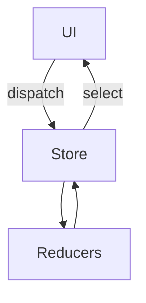
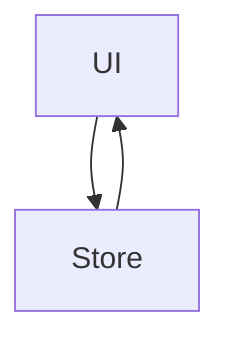
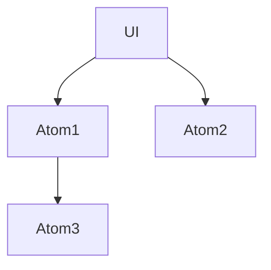

# 🧠 Redux Toolkit vs Zustand vs Jotai

### *Which State Management Library Should You Use?*

---

## 📌 Table of Contents

1. [Why This Comparison Matters](#why-this-comparison-matters)
2. [Mental Models](#mental-models-tldr)
3. [High Level Architecture Comparison](#high-level-architecture-comparison)
4. [Redux Toolkit (RTK)](#redux-toolkit-rtk)
5. [Zustand](#zustand)
6. [Jotai](#jotai)
7. [Side by Side Comparison Table](#side-by-side-comparison-table)
8. [Performance & Re render Behavior](#performance--re-render-behavior)
9. [Scalability & Team Collaboration](#scalability--team-collaboration)
10. [When to Use What (Decision Guide)](#when-to-use-what-decision-guide)
11. [Real World Use Case Mapping](#real-world-use-case-mapping)
12. [Interview Ready Summary](#interview-ready-summary)

---

## Why This Comparison Matters

As your React app grows, **local state stops being enough**.

You start dealing with:

* Shared data across screens
* Async API calls
* Caching
* Global UI state
* Predictable debugging

That’s where **Redux Toolkit, Zustand, and Jotai** come in — each solving the problem **very differently**.

---

## Mental Models (TL;DR)

| Library           | Think of it as                     |
| ----------------- | ---------------------------------- |
| **Redux Toolkit** | Centralized enterprise data system |
| **Zustand**       | Simple global store with hooks     |
| **Jotai**         | Atomic state pieces wired together |

---

## High Level Architecture Comparison

### Redux Toolkit



---

### Zustand



---

### Jotai



---

## Redux Toolkit (RTK)

### What It Is

Redux Toolkit is the **official, opinionated way** to use Redux.

It enforces:

* Single source of truth
* Immutable updates
* One-way data flow
* Predictability

---

### Example

```js
const usersSlice = createSlice({
  name: "users",
  initialState: [],
  reducers: {
    setUsers: (state, action) => action.payload,
  },
});
```

---

### Pros

✅ Best for **large teams**
✅ Excellent **debugging** (Redux DevTools)
✅ Clear architecture & conventions
✅ First-class async support (RTK Query)

---

### Cons

❌ More boilerplate than others
❌ Steeper learning curve

---

## Zustand

### What It Is

Zustand is a **minimal global state library** built on hooks.

No reducers.
No actions.
No ceremony.

---

### Example

```js
const useUserStore = create(set => ({
  users: [],
  setUsers: users => set({ users }),
}));
```

---

### Pros

✅ Extremely simple
✅ Minimal boilerplate
✅ Very fast to build features
✅ No provider required

---

### Cons

❌ No strict structure
❌ Can become messy in large apps
❌ Debugging less predictable

---

## Jotai

### What It Is

Jotai is based on **atomic state**.

Each piece of state is independent and composable.

---

### Example

```js
const usersAtom = atom([]);
const filteredUsersAtom = atom(get =>
  get(usersAtom).filter(u => u.active)
);
```

---

### Pros

✅ Fine-grained re-renders
✅ Derived state is very clean
✅ Excellent for complex UI logic

---

### Cons

❌ Harder mental model
❌ No central overview
❌ Not ideal for very large teams

---

## Side by Side Comparison Table

| Feature        | Redux Toolkit      | Zustand          | Jotai            |
| -------------- | ------------------ | ---------------- | ---------------- |
| Boilerplate    | Medium             | Very Low         | Low              |
| Mental Model   | Reducers & Actions | Hook-based store | Atomic state     |
| Debugging      | ⭐⭐⭐⭐⭐              | ⭐⭐⭐              | ⭐⭐               |
| Async Support  | Excellent          | Manual           | Manual           |
| Scalability    | ⭐⭐⭐⭐⭐              | ⭐⭐⭐              | ⭐⭐⭐              |
| Learning Curve | Medium             | Low              | Medium           |
| Best For       | Enterprise apps    | Small–mid apps   | Complex UI state |

---

## Performance & Re render Behavior

| Library       | Re-render Strategy    |
| ------------- | --------------------- |
| Redux Toolkit | Selector-based        |
| Zustand       | Subscription-based    |
| Jotai         | Atom-level reactivity |

👉 **Jotai** is the most granular
👉 **Redux** is the most predictable
👉 **Zustand** is the simplest

---

## Scalability & Team Collaboration

### Redux Toolkit

✔ Strong boundaries
✔ Feature isolation
✔ Best for 10+ developers

### Zustand

✔ Great for solo or small teams
❌ Hard to enforce discipline

### Jotai

✔ Great for UI-heavy apps
❌ Hard to trace ownership

---

## When to Use What (Decision Guide)

### Use Redux Toolkit if:

* App has **100+ screens**
* Multiple teams work in parallel
* You care about long-term maintainability

---

### Use Zustand if:

* App is small or medium
* You want speed & simplicity
* State logic is not complex

---

### Use Jotai if:

* UI logic is very complex
* Derived state is heavy
* Performance is critical

---

## Real World Use Case Mapping

| Scenario             | Best Choice   |
| -------------------- | ------------- |
| Enterprise dashboard | Redux Toolkit |
| Admin panel          | Zustand       |
| Design tools         | Jotai         |
| E-commerce           | Redux Toolkit |
| Side projects        | Zustand       |

---

## Interview Ready Summary

> **Redux Toolkit** is best for large, long-living apps.
> **Zustand** is best for simple, fast development.
> **Jotai** shines in UI-heavy, highly reactive scenarios.

---

## 🏁 Final Verdict

There is **no single best library**.

The best choice depends on:

* App size
* Team size
* Long-term goals

### If in doubt → **Redux Toolkit**


More Details:

Get all articles related to system design 
Hastag: SystemDesignWithZeeshanAli


[systemdesignwithzeeshanali](https://dev.to/t/systemdesignwithzeeshanali)

Git: https://github.com/ZeeshanAli-0704/front-end-system-design